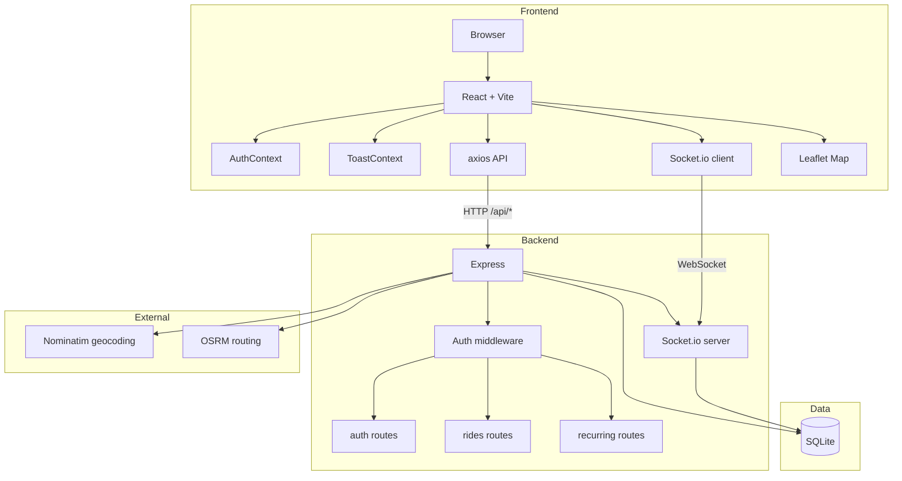
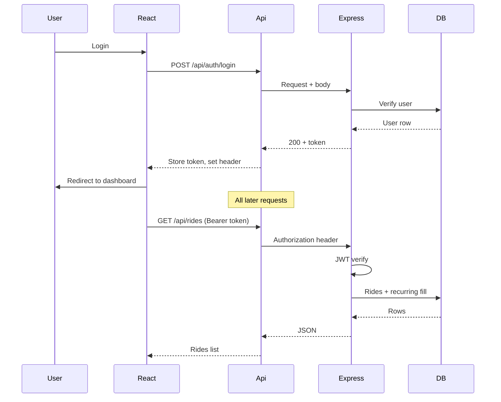
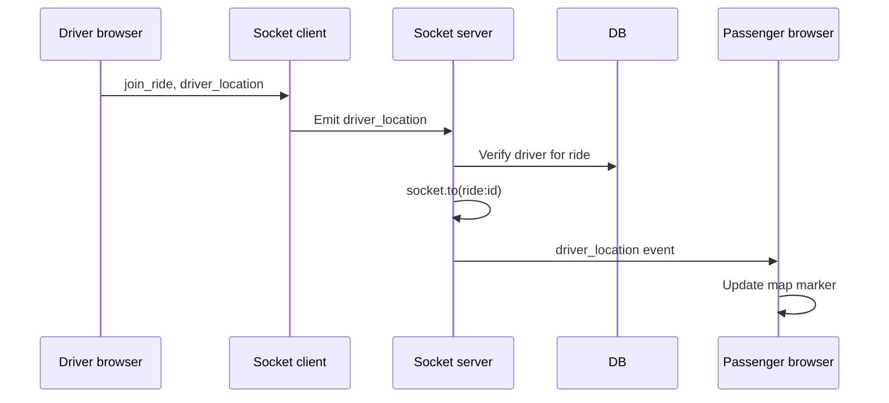
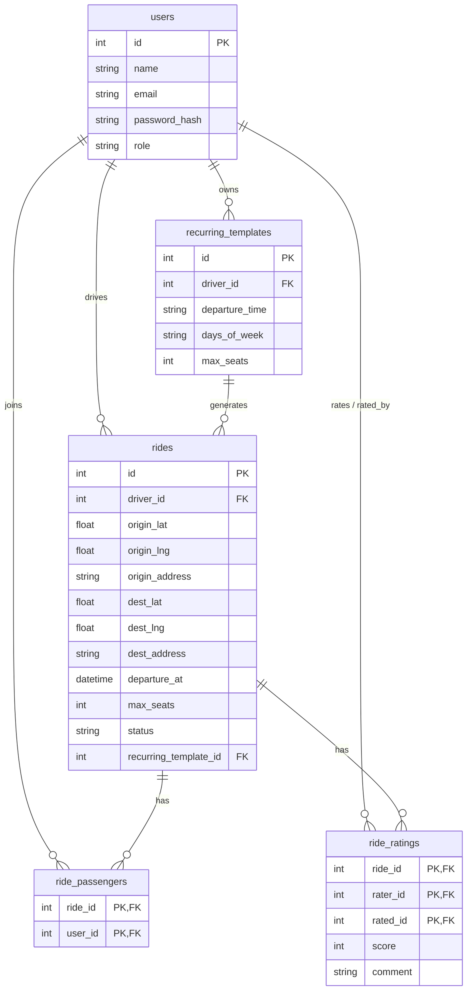
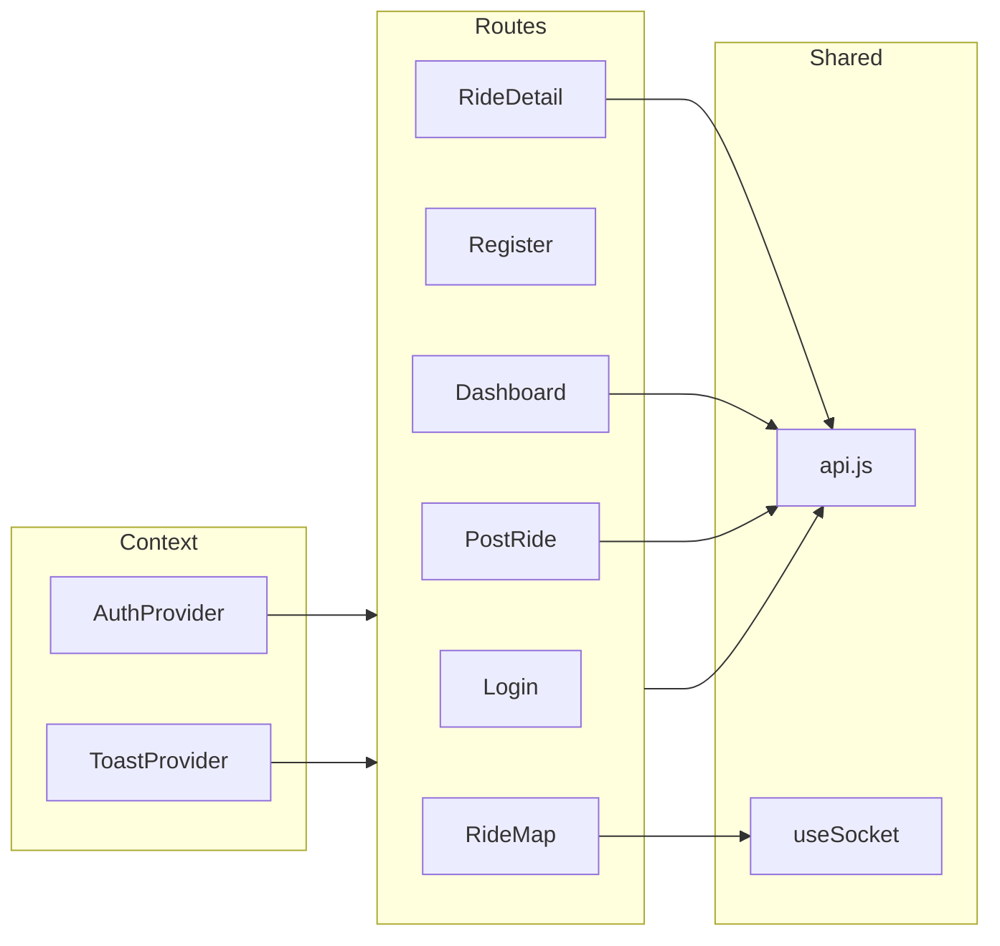
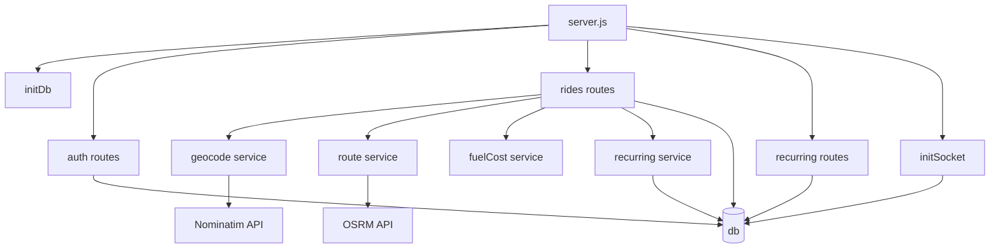

# SRM Carpool – Architecture

## High-level system

## Request and auth flow

## Real-time location (map)

## Data model (simplified)

## Frontend structure

## Backend structure

## Key files

| Layer   | Path | Purpose |
|---------|------|---------|
| Entry   | `backend/server.js` | Express app, HTTP server, Socket.io, route mounting |
| Entry   | `frontend/src/main.jsx` | React root, CSS |
| App     | `frontend/src/App.jsx` | Router, Auth + Toast providers, route definitions |
| Auth    | `frontend/src/context/AuthContext.jsx` | Token, user, login/logout, 401 listener |
| API     | `frontend/src/api.js` | Axios instance, 401 interceptor |
| Socket  | `frontend/src/hooks/useSocket.js` | Socket.io client hook |
| Socket  | `backend/socket.js` | join_ride, driver_location broadcast |
| DB      | `backend/config/db.js` | SQLite, schema, migrations |
| Rides   | `backend/routes/rides.js` | CRUD, join/leave, route, status, rate, location |
| Recurring | `backend/routes/recurring.js` | Recurring template CRUD |
| Recurring | `backend/services/recurring.js` | ensureRecurringRides for next 7 days |
| Geocode | `backend/services/geocode.js` | Nominatim lookup, cache |
| Route   | `backend/services/route.js` | OSRM route, cache |
| Fuel    | `backend/services/fuelCost.js` | Cost, CO₂ saved |
